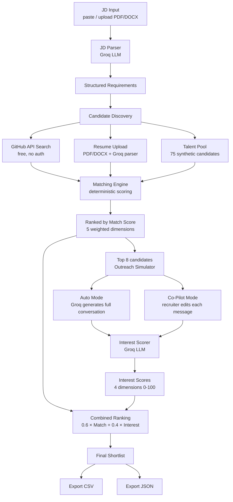

# 🎯 TalentScout AI — AI-Powered Talent Scouting & Engagement Agent

> An autonomous AI recruiting agent that parses job descriptions, discovers candidates from multiple sources, conducts simulated outreach conversations, and produces a ranked shortlist with explainable scoring — all running client-side in the browser.

[](https://app.netlify.com/start/deploy?repository=https://github.com/yourusername/talent-scout-ai)

---

## ✨ Features

- **JD Input** — Paste text or upload PDF/DOCX job descriptions
- **AI JD Parsing** — Groq LLM extracts structured requirements from any JD
- **Multi-Source Discovery** — GitHub public API, uploaded resumes (PDF/DOCX), built-in talent pool of 75 candidates
- **Resume Parsing** — PDF and DOCX resumes parsed into candidate profiles via AI
- **Deterministic Match Scoring** — 5-dimension weighted scoring with full explanations
- **Simulated Outreach** — Auto Mode (fully autonomous) or Co-Pilot Mode (recruiter edits)
- **AI Interest Assessment** — 4-dimension interest scoring from conversation analysis
- **Ranked Shortlist** — Combined score (60% Match + 40% Interest) with medal rankings
- **Side-by-Side Compare** — Compare up to 3 candidates across all dimensions
- **Export** — Download shortlist as CSV or full JSON with conversations
- **Beautiful UI** — Dark/light mode, framer-motion animations, responsive design

---

## 🏗 Architecture



---

## 📊 Scoring Methodology

### Match Score (0–100)

| Dimension | Weight | Method |
|-----------|--------|--------|
| Skill Match | **40%** | Jaccard intersection of candidate skills vs required. Nice-to-have adds up to +15 bonus |
| Experience Fit | **25%** | Proximity to required range. Exact = 100, ±1yr = 80, ±2yr = 60, ±3yr = 40, beyond = 20 |
| Education | **15%** | Degree + field relevance. PhD = 100, M.Tech relevant = 90, B.Tech relevant = 80 |
| Location | **10%** | City match + relocation willingness + work mode (remote/hybrid/onsite) |
| Availability | **10%** | Notice period + job-seeking status. Active + immediate = 100, passive = 50, not-looking = 15 |

### Interest Score (0–100)

| Dimension | Weight | Source |
|-----------|--------|--------|
| Enthusiasm | 25% | Conversation tone, questions asked, positive language |
| Availability | 25% | Timeline compatibility, notice period discussion |
| Salary Alignment | 25% | Expectations vs JD range from conversation |
| Willingness to Proceed | 25% | Agreed to next steps, interview requests |

### Final Combined Score

```
Combined = 0.6 × Match Score + 0.4 × Interest Score
```

Match score is weighted higher (60%) because it's deterministic and based on objective candidate facts.
Interest score (40%) adds signal from the AI-simulated conversation to gauge enthusiasm and fit.

---

## 🛠 Tech Stack

| Layer | Technology |
|-------|-----------|
| Frontend | React 18 + Vite 5 |
| Styling | Tailwind CSS v4 (`@tailwindcss/vite`) |
| AI / LLM | Groq API — Llama 3.3 70B (free tier) |
| Candidate Discovery | GitHub REST API (free, no auth needed) |
| PDF Parsing | pdf.js 4.4 (worker loaded from CDN) |
| DOCX Parsing | mammoth.js |
| Animations | Framer Motion |
| CSV Export | PapaParse |
| State | React Context API + hooks |
| Hosting | Netlify (free tier) |

---

## 🚀 Getting Started

### Prerequisites

- **Node.js 18+**
- **Free Groq API key** — sign up at [console.groq.com/keys](https://console.groq.com/keys) (no credit card needed)

### Local Setup

```bash
# Clone the repo
git clone https://github.com/yourusername/talent-scout-ai.git
cd talent-scout-ai

# Install dependencies
npm install

# Copy env file and add your Groq API key
cp .env.example .env
# Edit .env and set VITE_GROQ_API_KEY=gsk_your_key_here

# Start dev server
npm run dev
```

Open [http://localhost:5173](http://localhost:5173) in your browser.

You can also add the API key directly in the app UI — click **"Add API Key"** in the navbar.

### Build for Production

```bash
npm run build
# Output in ./dist
```

### Deploy to Netlify

1. Push your repo to GitHub
2. Connect to [Netlify](https://netlify.com) → **New site from Git**
3. Build command: `npm run build`
4. Publish directory: `dist`
5. Add environment variable: `VITE_GROQ_API_KEY` (optional — users can enter their own key in the UI)

The `netlify.toml` is pre-configured for SPA routing.

---

## 📋 Usage Guide

### 1. Add Your API Key
Click **"Add API Key"** in the navbar and enter your free Groq API key (`gsk_...`).

### 2. Provide a Job Description
- **Paste** the JD text directly, or
- **Upload** a PDF or DOCX file — the text is extracted automatically, or
- Click **"Try sample JD"** to use the built-in Senior Backend Engineer JD

### 3. Configure Discovery Sources
Toggle which sources the agent should search:
- **Talent Pool** — 75 pre-loaded synthetic candidates (always fast)
- **GitHub** — Searches public profiles by skills and location (needs internet)
- **Resume Upload** — Upload PDFs/DOCXs in the Discovery tab

### 4. Choose Agent Mode
- **Auto Mode** — Agent runs conversations completely autonomously
- **Co-Pilot Mode** — Agent drafts recruiter messages; you edit before "sending"

### 5. Run the Agent
Click **"Run Agent"** and watch the live activity log as the pipeline executes:
1. JD parsing → 2. Candidate discovery → 3. Scoring → 4. AI outreach → 5. Interest analysis → 6. Ranked shortlist

### 6. Review Results
Click any stage in the left sidebar to inspect its output. Click any row in the shortlist table for a full candidate report.

### 7. Export
Use **Export CSV** or **Export JSON** buttons on the shortlist page.

---

## 📋 Sample Input / Output

### Sample JD: Senior Backend Engineer at FinStack Technologies

> 4–8 years experience · Python/Java · Microservices · PostgreSQL · AWS · Docker · Kubernetes · Bangalore (hybrid)

### Sample Output: Ranked Shortlist

| Rank | Candidate | Match | Interest | Combined | Action |
|------|-----------|-------|----------|----------|--------|
| 🥇 1 | Priya Sharma | 89 | 85 | 87.4 | Schedule Interview |
| 🥈 2 | Kiran Joshi | 84 | 82 | 83.2 | Schedule Interview |
| 🥉 3 | Shilpa Nayak | 81 | 78 | 79.8 | Fast-Track |
| 4 | Deepika Krishnan | 78 | 71 | 75.2 | Send Role Brief |
| 5 | Vivek Reddy | 75 | 68 | 72.2 | Schedule Interview |

---

## 🔒 Privacy & Security

- **No backend** — all processing happens in your browser
- **API key** stored only in `localStorage` on your device
- **No candidate data** sent to any server (except Groq for AI processing)
- **No tracking, analytics, or data collection**

---

## 🤝 Contributing

Pull requests welcome! For major changes, please open an issue first.

```bash
# Fork and clone
git checkout -b feature/your-feature
npm install
npm run dev
# Make changes, then PR
```

---

## 📄 License

MIT — free to use, modify, and distribute.

---

*Built with ❤️ using Groq + Llama 3.3 70B + React + Tailwind CSS*
