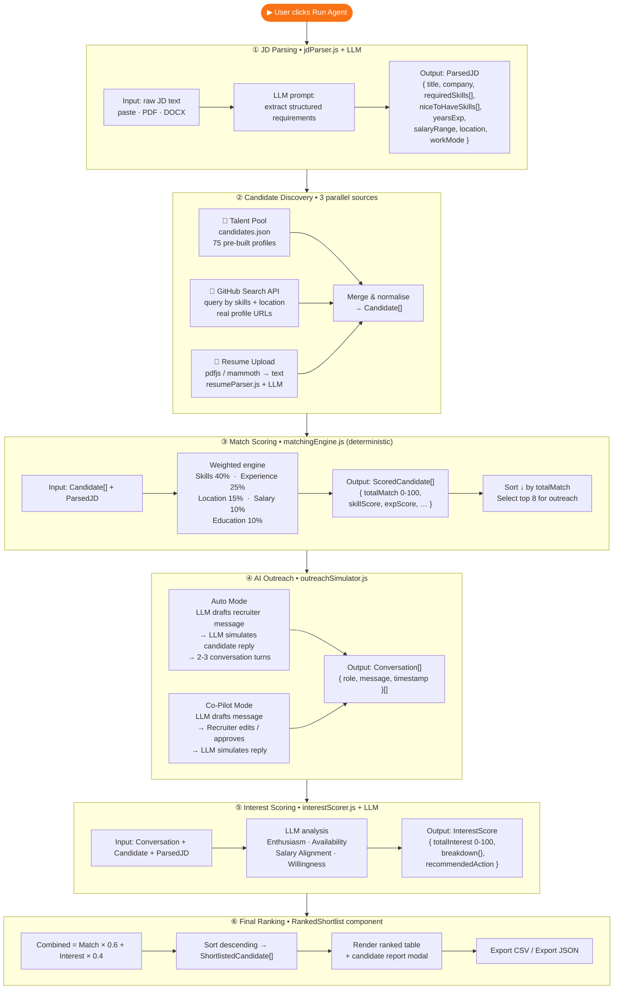
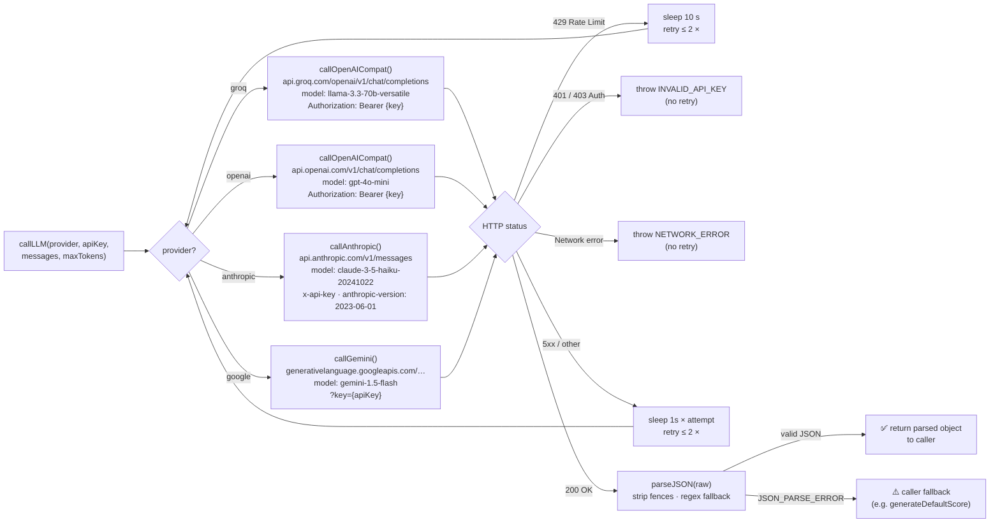
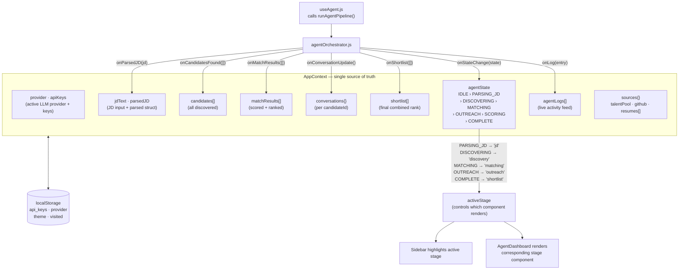

# TalentScout AI 🎯

An autonomous AI recruiting agent that takes a job description and — in under 5 minutes — discovers candidates, scores their fit, simulates personalised recruiter outreach, and produces a ranked shortlist. Runs entirely in the browser; no backend or server required.


Deployed on Vercel: https://talent-scout-ai-pi.vercel.app/

---

## Demo

> Paste a JD → configure sources → click **Run Agent** → watch the 5-stage pipeline execute live.

The app starts with a marketing landing page. Click **Launch TalentScout AI** (or the navbar logo to return to it). Your "visited" state is saved in `localStorage` so repeat visits open the app directly.

---

## Features

- **AI-powered JD parsing** — extracts title, required skills, nice-to-have skills, experience range, salary, location, and work mode from any free-form job description
- **Multi-source candidate discovery** — 75-candidate built-in talent pool, live GitHub profile search (real URLs, public API), and PDF/DOCX resume uploads — all configurable before you run the agent
- **Weighted match scoring** — deterministic 5-dimension scoring (skills 40 %, experience 25 %, location 15 %, salary 10 %, education 10 %) with skill alias expansion (`node` = `nodejs` = `node.js`)
- **Auto & Co-Pilot outreach modes** — Auto runs the full conversation pipeline hands-free; Co-Pilot pauses for you to review and edit each recruiter message
- **Interest scoring** — 4-dimension LLM analysis of the simulated conversation (enthusiasm · availability · salary alignment · willingness to proceed)
- **Ranked shortlist** — combined score (60 % match + 40 % interest), sortable table, full candidate report modal, CSV and JSON export
- **4 AI providers** — Groq (free), OpenAI, Anthropic Claude, Google Gemini — switch from the navbar dropdown at any time
- **Dark & light theme** — persisted, with distinct design language per theme
- **No backend** — all API calls go directly from your browser to the AI provider of your choice

---

## Architecture & System Design

### 1. High-level system architecture

The entire application runs **client-side**. There is no backend server. All compute happens in the browser; the only outbound traffic is LLM API calls and the GitHub Search API.

```
┌─────────────────────────────────────────────────────────────────────────────┐
│                          Browser  (Client-Side Only)                        │
│                                                                             │
│  ┌─────────────────────────────────────────────────────────────────────┐    │
│  │  React SPA  (Vite 5 + Tailwind v4 + Framer Motion)                  │    │
│  │                                                                     │    │
│  │   Landing Page  ──►  Main App (5-Stage Pipeline UI)                 │    │
│  │                              │                                      │    │
│  │              ┌───────────────▼───────────────────┐                  │    │
│  │              │        AppContext (State)          │                 │    │
│  │              │  jdText · parsedJD · candidates   │◄──localStorage   │    │
│  │              │  matchResults · conversations     │   (API keys,     │    │
│  │              │  shortlist · agentState · logs    │    theme,        │    │
│  │              └───────────────┬───────────────────┘    provider)     │    │
│  │                              │                                      │    │
│  │              ┌───────────────▼───────────────────┐                  │    │
│  │              │    agentOrchestrator.js            │                 │    │
│  │              │    (5-stage pipeline runner)       │                 │    │
│  │              └──┬────────┬────────┬────────┬──────┘                 │    │
│  │                 │        │        │        │                        │    │ 
│  │           jdParser  matchingEngine  outreachSimulator  interestScorer    │
│  │           resumeParser  fileReader  githubDiscovery  exportUtils    │    │
│  │                 │                             │                     │    │
│  │              ┌──▼─────────────────────────────▼──┐                  │    │
│  │              │        llmClient.js               │                  │    │
│  │              │   (unified multi-provider router)  │                 │    │
│  └──────────────┴──────────────┬────────────────────┴─────────────────┘     │
└─────────────────────────────────┼───────────────────────────────────────────┘
                                  │  HTTPS
          ┌───────────────────────┼───────────────────────┐
          ▼                       ▼                       ▼                   ▼
   ⚡ Groq API            🤖 OpenAI API         🧠 Anthropic API     ✨ Gemini API
  Llama 3.3 70B           GPT-4o Mini          Claude Haiku 3.5     1.5 Flash
  (Free tier)             (Paid)               (Paid)               (Free tier)

                    🐙 GitHub Search API  (public, no auth required)
```

---

### 2. Five-stage pipeline data flow

Each stage produces a typed output that feeds directly into the next stage.



---

### 3. LLM client — multi-provider routing & retry



---

### 4. React component tree

```
App.jsx  (BrowserRouter + AppProvider)
└── MainLayout
    ├── Navbar              ← provider dropdown · API key · theme toggle · logo→home
    │
    ├── [AnimatePresence]
    │   ├── LandingPage     ← hero · stats · pipeline viz · feature cards · CTA
    │   │
    │   └── App view  (h-screen flex layout)
    │       ├── Sidebar     ← pipeline stage nav · stats · recent activity · run indicator
    │       └── main  (scrollable)
    │           ├── AgentDashboard
    │           │   ├── AgentControls   ← Auto/Co-Pilot toggle · Run Agent button
    │           │   ├── AgentStatusBar  ← progress bar · stage dots · percentage
    │           │   │
    │           │   ├── [AnimatePresence — active stage]
    │           │   │   ├── JDInput          stage: jd
    │           │   │   │   └── DragDropZone (resume upload, inline)
    │           │   │   ├── CandidateDiscovery  stage: discovery
    │           │   │   │   ├── TalentPool
    │           │   │   │   ├── GitHubSearch
    │           │   │   │   └── ResumeUpload
    │           │   │   ├── MatchResults     stage: matching
    │           │   │   │   ├── MatchFilters
    │           │   │   │   ├── CandidateCard  ×N
    │           │   │   │   │   └── ScoreBreakdown (expand)
    │           │   │   │   └── CompareView (modal)
    │           │   │   ├── OutreachPanel    stage: outreach
    │           │   │   │   ├── AutoModeRunner
    │           │   │   │   ├── CoPilotMode
    │           │   │   │   └── ConversationView  ×N
    │           │   │   └── RankedShortlist  stage: shortlist
    │           │   │       ├── ShortlistStats
    │           │   │       ├── ExportButtons
    │           │   │       └── Modal → CandidateReport
    │           │   │
    │           │   └── AgentActivityLog    ← live terminal log
    │           │
    │           └── Footer
    │
    ├── ApiKeyModal         ← tabs: Groq · OpenAI · Claude · Gemini
    └── AboutModal          ← scoring methodology explainer
```

---

### 5. State management & data flow



---

## Quick start

### Prerequisites

- **Node.js 18+** — [nodejs.org](https://nodejs.org)
- An API key from at least one provider:

| Provider | Model | Free? | Get key |
|---|---|---|---|
| **Groq** | Llama 3.3 70B | ✅ Free | [console.groq.com/keys](https://console.groq.com/keys) |
| **Google Gemini** | 1.5 Flash | ✅ Free | [aistudio.google.com](https://aistudio.google.com/app/apikey) |
| **OpenAI** | GPT-4o Mini | 💳 Paid | [platform.openai.com/api-keys](https://platform.openai.com/api-keys) |
| **Anthropic Claude** | Haiku 3.5 | 💳 Paid | [console.anthropic.com](https://console.anthropic.com/settings/keys) |

### Install & run

```bash
cd talent-scout-ai
npm install
npm run dev
```

Open [http://localhost:5173](http://localhost:5173), click **Add API Key** in the navbar, and paste your key.

### Production build

```bash
npm run build     # outputs to ./dist
npm run preview   # preview locally
```

---

## Usage walkthrough

**1. Add your API key** — Click **Add API Key** in the navbar. Keys for all 4 providers can be stored simultaneously; switch the active provider from the dropdown.

**2. Paste or upload a JD** — Paste text, upload a PDF/DOCX, or click *Try sample* to load a pre-built Senior Backend Engineer JD.

**3. Configure sources** — Check the discovery sources you want:
- 📂 **Talent Pool** — instant, 75 built-in candidates
- 🐙 **GitHub Search** — real GitHub profiles found by skill keywords
- 📄 **Upload Resumes** — drag-and-drop PDFs/DOCXs directly on the JD page

**4. Choose agent mode** — *Auto* (hands-free) or *Co-Pilot* (review each message).

**5. Click Run Agent** — watch the live activity log. Navigate between pipeline stages using the left sidebar at any point.

**6. Review the shortlist** — Click any candidate row for a full report. Sort by match, interest, or combined score. Export as CSV or JSON.

---

## Scoring methodology

### Match score (0–100)

| Dimension | Weight | Logic |
|---|---|---|
| Skills | 40% | Required skills weighted 3×, nice-to-have 1×; alias-aware matching |
| Experience | 25% | Candidate years vs JD minimum; capped at 100 |
| Location | 15% | Exact city > same region > open to relocate + work-mode bonus |
| Salary | 10% | Candidate range vs JD range overlap |
| Education | 10% | Degree level and field relevance |

### Interest score (0–100)

Scored by the LLM after reading the full simulated conversation:

| Dimension | Weight |
|---|---|
| Enthusiasm | 25% |
| Availability / notice period | 25% |
| Salary alignment | 25% |
| Willingness to proceed | 25% |

### Combined score

```
Combined = (Match × 0.6) + (Interest × 0.4)
```

---

## Project structure

```
talent-scout-ai/
├── src/
│   ├── App.jsx                      # Root — landing page ↔ main app routing
│   ├── context/
│   │   └── AppContext.jsx           # All global state (pipeline, theme, API keys, provider)
│   ├── hooks/
│   │   ├── useAgent.js              # Triggers the full 5-stage pipeline
│   │   ├── useLocalStorage.js       # Persistent state helper
│   │   └── useFileExtractor.js      # File reading hook
│   ├── utils/
│   │   ├── llmClient.js             # Unified LLM client — Groq / OpenAI / Claude / Gemini
│   │   ├── agentOrchestrator.js     # Orchestrates all 5 stages
│   │   ├── jdParser.js              # JD text → structured JSON via LLM
│   │   ├── matchingEngine.js        # Deterministic weighted match scoring
│   │   ├── outreachSimulator.js     # Recruiter message + candidate reply simulation
│   │   ├── interestScorer.js        # 4-dimension interest analysis via LLM
│   │   ├── resumeParser.js          # PDF/DOCX text → candidate profile via LLM
│   │   ├── fileReader.js            # pdfjs-dist (local worker) + mammoth text extraction
│   │   ├── githubDiscovery.js       # GitHub Search API integration
│   │   └── exportUtils.js          # CSV and JSON export helpers
│   ├── components/
│   │   ├── Landing/                 # Marketing landing page + in-app welcome screen
│   │   ├── Layout/                  # Navbar, Sidebar, Footer
│   │   ├── Agent/                   # Dashboard, controls, status bar, activity log
│   │   ├── JD/                      # JD input, file upload, parsed JD view
│   │   ├── Discovery/               # Talent pool browser, GitHub search, resume upload
│   │   ├── Matching/                # Results table, score breakdown, compare view
│   │   ├── Outreach/                # Auto mode runner, co-pilot mode, conversation view
│   │   ├── Shortlist/               # Ranked table, stats, export, candidate report modal
│   │   ├── Settings/                # API key modal (multi-provider), about modal
│   │   └── UI/                      # Shared primitives — ScoreBar, SkillTag, Modal, etc.
│   └── data/
│       └── candidates.json          # 75-candidate built-in talent pool
├── index.html
├── vite.config.js
├── package.json
└── requirements.txt
```

---

## Tech stack

| Layer | Technology |
|---|---|
| UI framework | React 18 |
| Build tool | Vite 5 |
| Styling | Tailwind CSS v4 (no config file — `@tailwindcss/vite` plugin) |
| Animations | Framer Motion |
| Icons | Lucide React |
| PDF parsing | pdfjs-dist 4.x (local worker via `?url` import — version-safe) |
| DOCX parsing | mammoth |
| CSV export | PapaParse |
| Routing | React Router v6 |

---

## Deployment

### Netlify / Vercel

```
Build command:  npm run build
Publish dir:    dist
```

No server-side environment variables are required — users enter their own API keys in the UI. To optionally pre-fill a Groq key:

```
VITE_GROQ_API_KEY=gsk_your_key_here
```

---

## Privacy

- **Everything runs in your browser.** No candidate data, resumes, or job descriptions are sent to any server other than the AI provider you choose.
- API keys are stored only in your browser's `localStorage` and never leave your device.
- GitHub search uses the public GitHub Search API — no token or authentication required.

---

## License

MIT — free to use, modify, and deploy.
